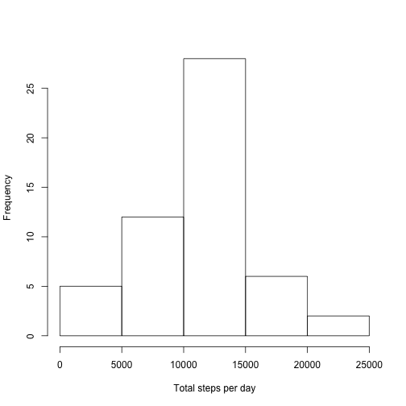
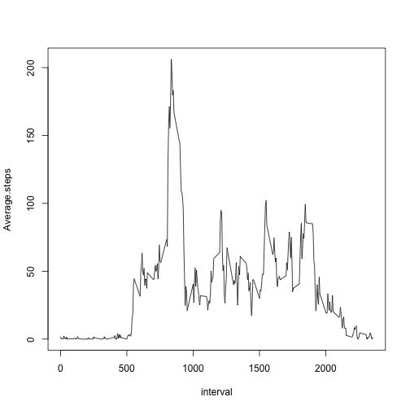
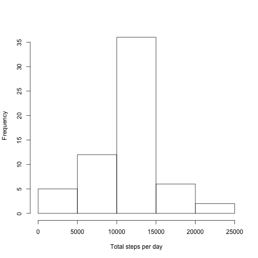
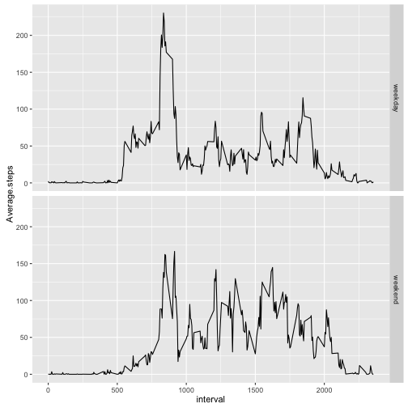

Assignment: Course Project 1
===================================

This assignment makes use of data from a personal activity monitoring device. This device collects data at 5 minute intervals through out the day. The data consists of two months of data from an anonymous individual collected during the months of October and November, 2012 and include the number of steps taken in 5 minute intervals each day.

##Loading the libraries

```r
library(dplyr)
library(ggplot2)
```

##Loading the data

```r
activity <- read.csv("activity.csv")
```

##What is mean total number of steps taken per day?

R code to calculate the total number of steps taken per day

```r
activityGrouped <- group_by(activity, date)
totalStepsPerDay <- summarise(activityGrouped, steps = sum(steps))
```

Histogram of the total number of steps taken each day

```r
hist(totalStepsPerDay$steps, xlab = "Total steps per day", main = "")
```



Mean of the total number of steps taken per day

```r
mean(totalStepsPerDay$steps, na.rm = T)
```

```
## [1] 10766.19
```

Median of the total number of steps taken per day

```r
median(totalStepsPerDay$steps, na.rm = T)
```

```
## [1] 10765
```

##What is the average daily activity pattern?

Time series plot of the 5-minute interval and the average number of steps taken, averaged across all days

```r
activityGrouped <- group_by(activity, interval)
avgStepsPerInterval <- summarise(activityGrouped, Average.steps = mean(steps, na.rm = T))
with(avgStepsPerInterval, plot(x=interval,y = Average.steps, type = "l"))
```



5-minute interval, on average across all the days in the dataset, which contains the maximum number of steps

```r
indmax <- which(avgStepsPerInterval$Average.steps==max(avgStepsPerInterval$Average.steps, na.rm = T), arr.ind = F)
avgStepsPerInterval$interval[indmax]
```

```
## [1] 835
```

##Imputing missing values

 Total number of missing values in the dataset (i.e. the total number of rows with NAs)

```r
sum(is.na(activity$steps))
```

```
## [1] 2304
```

Missing values are imputed using the mean for that 5-minute interval to create a new dataset

```r
imputedActivity <- activity
indMissing <- which(is.na(imputedActivity$steps))
for (i in 1:length(indMissing)) {
    intrvl <- imputedActivity$interval[indMissing[i]]
    mean <- subset(avgStepsPerInterval, interval == intrvl)[,2]
    imputedActivity$steps[indMissing[i]] <- mean
}
```
 
Histogram of the total number of steps taken each day

```r
ImactivityGrouped <- group_by(imputedActivity, date)
ImactivityGrouped$steps  <- as.numeric(ImactivityGrouped$steps)
imTotalStepsPerDay <- summarise(ImactivityGrouped, steps = sum(steps))
hist(imTotalStepsPerDay$steps, xlab = "Total steps per day", main = "")
```



New mean of the total number of steps taken per day

```r
mean(imTotalStepsPerDay$steps, na.rm = T)
```

```
## [1] 10766.19
```

New median of the total number of steps taken per day

```r
median(imTotalStepsPerDay$steps, na.rm = T)
```

```
## [1] 10766.19
```

New median value is different form the previous value. Medain has changed slightly due to increased number of observations. Mean stays the same.

##Are there differences in activity patterns between weekdays and weekends?

New factor variable created to indicate whether a given date is a weekday or weekend day.

```r
imputedActivity$date <- as.Date(imputedActivity$date, "%Y-%m-%d")
weekend <- c("Saturday", "Sunday")
weekendDays <- which(weekdays(imputedActivity$date) %in% weekend)
imputedActivity$day <- "weekday"
imputedActivity$day[weekendDays] <- "weekend"
```

Panel plot containing a time series plot of the 5-minute interval and the average number of steps taken, averaged across all weekday days or weekend days.

```r
ImactivityGrouped <- group_by(imputedActivity, interval, day)
ImactivityGrouped$steps  <- as.numeric(ImactivityGrouped$steps)
ImavgStepsPerInterval <- summarise(ImactivityGrouped, Average.steps = mean(steps, na.rm = T))
gg1 <- ggplot(ImavgStepsPerInterval, aes(interval,Average.steps))
gg1+geom_line()+facet_grid(day~.)
```




